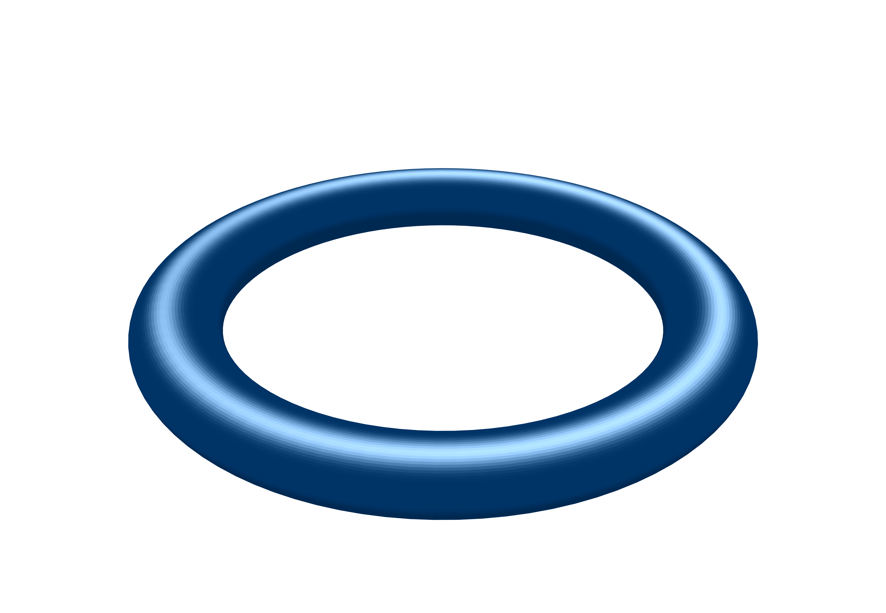
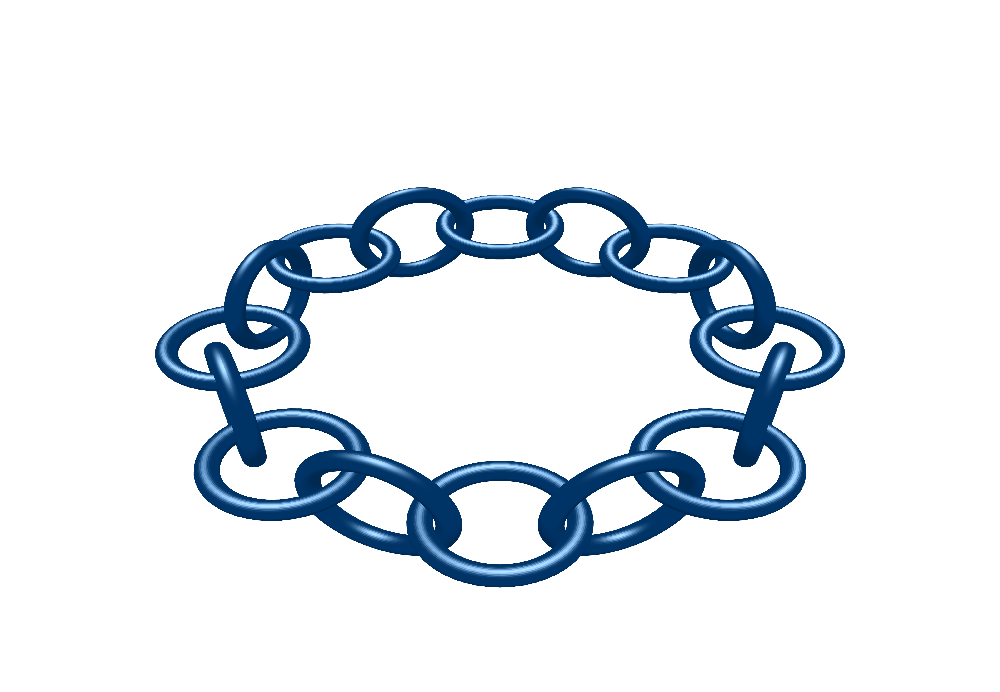
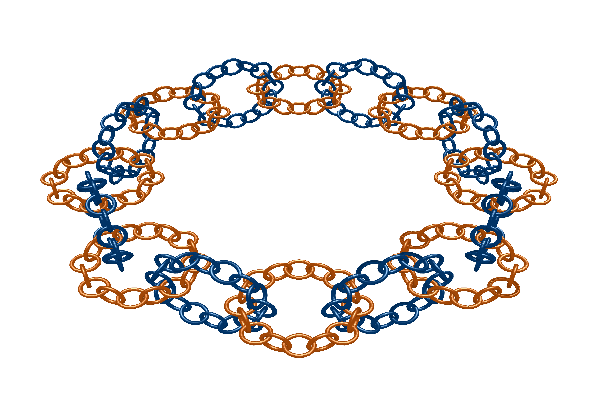

# Antoine's Necklace: 3D Fractal Visualization

A high-performance Python implementation for generating Antoine's Necklace, a topological fractal where each component is a chain of smaller, interlocking tori. This project is optimized for Apple Silicon (M4) and high-resolution static exports using Plotly and NumPy.

## 🌀 About the Fractal
Antoine's Necklace is a classic example of a Cantor set in 3D space that is "tame" yet topologically complex. Each level of the necklace is formed by replacing a solid torus with a chain of smaller interlocking tori. This visualization utilizes an advanced "Arch and Cradle" geometry-slicing technique to allow Level 2 chains to physically thread through the center of Level 1 links, creating a realistic "woven" appearance.

<table>
  <tr>
    <td align="center">
      <br/>
      <b>Level 0: Base Torus</b>
    </td>
    <td align="center">
      <br/>
      <b>Level 1: Primary Chain</b>
    </td>
    <td align="center">
      <br/>
      <b>Level 2: Nested Fractal</b>
    </td>
  </tr>
</table>

## 📁 Repository Structure

* `Antoines_NecklaceClass.py:` The core Python class containing the mathematical logic for coordinate rotation, torus generation, and fractal levels.

* `Antoine_Necklace_Implementation.ipynb:` A Jupyter Notebook containing walkthroughs and various implementations/test cases.

* Generated Figures: High-resolution PNG renders (e.g., antoines_necklace.png) demonstrating the final output at different densities.

## 🚀 Features
Recursive Geometry: Supports Level 0 (Base Torus), Level 1 (First Chain), and Level 2 (Nested Chains).

Interlocking Logic: Mathematically precise range-shifting to ensure chains pass through one another without visual gaps.

## Customizable Aesthetics:

* Number of Tori: Select the number of tori in each level.
  
* Tilt Angle: Choose the angle for every other tori in each level to be tilted at (default is $\pi/2$).

* Dual-Tone Alternating Colors: Easily toggle between single-color and alternating "sandwich" colors (e.g., Deep Blue and Burnt Orange).

* Lighting Control: Fine-tune specular highlights, Fresnel reflections, and surface roughness.

* High-Res Export: Built-in support for Kaleido to export professional-grade static images at custom scales.
* Export Angle: Choose the "eye" or angle at which the static image is taken from.

## 🛠️ Installation
Clone the repository:


```Bash
git clone https://github.com/YOUR_USERNAME/Antoines_Necklace.git
cd Antoines_Necklace
```

### Install dependencies:

```Bash
pip install numpy plotly kaleido
```

## 💻 Quick Start
You can use the class in your own scripts or the provided Jupyter Notebook:

``` Python
from Antoines_NecklaceClass import AntoineNecklace
```
```
#Initialize with 16 links per level
necklace = AntoineNecklace(N_l1=16, N_l2=16)
```
```
# Configure for high-res export
necklace.mesh_res = 30       # Surface smoothness
necklace.scale = 2           # Image resolution multiplier
necklace.file_name = "my_necklace_render.png"
```
```
# Generate Level 2
necklace.generate_level_two(parent_l2_C=30)
```

⚠️ Performance Optimization
Rendering Level 2 at 16×16 density generates nearly 500,000 vertices.

* M4 Users: Expect renders to complete in 1–3 minutes depending on mesh_res.

* Resolution Tip: For faster development, set self.mesh_res = 15.

HTML Note: Interactive HTML exports are disabled by default for high-density levels to prevent browser crashes; static PNG export is the recommended output.

## 📄 License
This project is licensed under the MIT License - see the LICENSE file for details.
